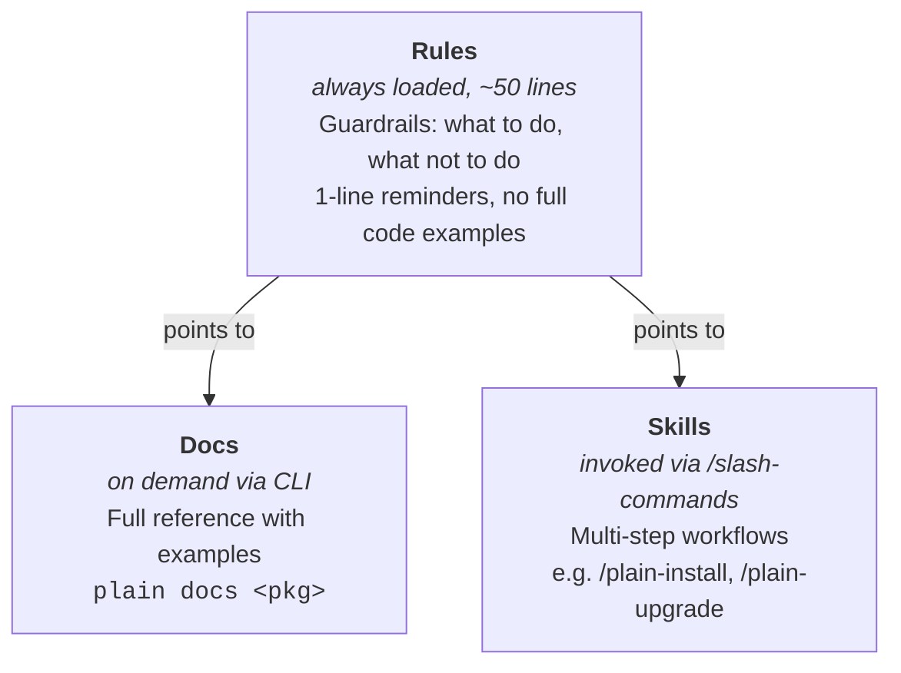

---
paths:
  - "**/agents/.claude/**"
  - ".claude/rules/**"
  - ".claude/skills/**"
---

# Docs, rules, and skills (developing Plain itself)

Plain ships three tiers of AI guidance per package, each with a different purpose:

How to write a rule or skill is documented for package authors in `plain/plain/agents/README.md` — read that first. README conventions are in `.claude/rules/readme.md`. What follows is specific to this repo.

## Where Django corrections go

Django-specific corrections (e.g., "use X not Django's Y") are split by scope so each loads only where it's relevant:

- **Core** framework diffs (URLs, request data, middleware) live in `plain.md`'s "Key Differences from Django" section.
- **Package-specific** diffs live in that package's rule under its own `## Differences from Django` section (see `plain-postgres`, `plain-templates`).

Keep each correction in exactly one place — don't duplicate a package diff into `plain.md`. The rest of a rule should describe how Plain works, not what Django does differently.

## File locations

- **Package-level `<package>/plain/<module>/agents/.claude/`**: Source of truth. Shipped to end users via `plain agent install`, so anything written here is user-facing.
- **Top-level `.claude/rules/` and `.claude/skills/`**: Copies for developing _this repo_. Generated by `plain agent install` — do not edit directly.
- Rules and skills whose names do **not** start with `plain`/`plainx` are never managed by `plain agent install` (see `_is_plain_item` in `plain/plain/cli/agent.py`). That is where guidance about developing this repo lives, since it has no package-level counterpart and must not ship to users: the `release` skill and the `readme`, `csp-safe`, `tests-layout`, and `agent-guidance` rules.

When editing a rule or skill that has a package-level counterpart, always edit the package-level file in `agents/.claude/` first. Then run `plain agent install` to sync.
