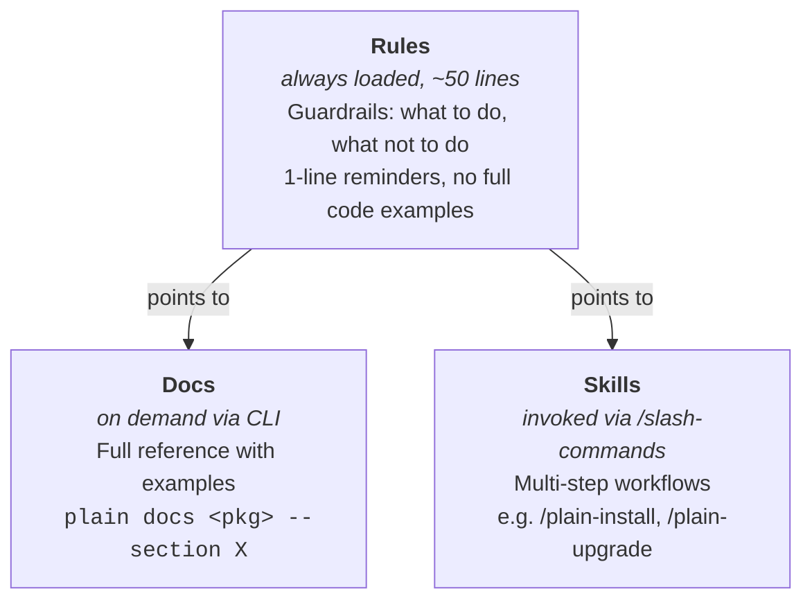

# Claude

## After making code changes

1. **Format and lint**: `./scripts/fix` (always run this before committing)
2. **Run tests**: `./scripts/test [package]`

## Commands

Always use `./scripts/` commands from the repo root — never run `uv run plain fix`, `uv run plain pre-commit`, etc. directly in the `example/` directory.

| Command                      | Purpose                    |
| ---------------------------- | -------------------------- |
| `./scripts/fix`              | Format and lint code       |
| `./scripts/pre-commit`       | Full pre-commit validation |
| `./scripts/test [package]`   | Run tests                  |
| `./scripts/makemigrations`   | Create database migrations |
| `./scripts/type-check <dir>` | Type check a directory     |
| `uv run python`              | Open Python shell          |

## Scratch directory

Use the `scratch` directory for temporary files and experimentation. This directory is gitignored.

## Testing changes

The `example` directory contains a demo app. Use `cd example && uv run plain` to test.

## Backwards compatibility

Don't worry about backwards compatibility for API changes like function renames, argument changes, or import path updates. The `/plain-upgrade` skill integrates an AI agent into the upgrade process that can automatically fix user code during updates.

Deeper breaking changes that users can't directly control or fix in their own code still need careful consideration.

## Coding style

- Prefer unique, greppable names over overloaded terms
- Verify changes with `print()` statements, then remove before committing

## Docs, rules, and skills

Plain ships three tiers of AI guidance per package, each with a different purpose:



### Rules

Concise guardrails always loaded into context. Keep them short (~50 lines) — bullet-point reminders, not tutorials. Point to docs for details. Use `paths:` frontmatter to scope rules to relevant files.

Django-specific corrections (e.g., "use X not Django's Y") belong only in `plain.md`'s "Key Differences from Django" section. Package rules should describe how Plain works, not what Django does differently. It's fine for those corrections to cross package boundaries — they live in one place.

Example pattern (from plain-models rule → querying section):

```
- Use `select_related()` for FK access in loops, `prefetch_related()` for reverse/M2N
- Use `.exists()` not `.count() > 0`, `.count()` not `len(qs)`

Run `uv run plain docs models --section querying` for full patterns with code examples.
```

### Docs

Package README.md files are the primary documentation — rendered on the website, PyPI, and GitHub. They're also available to AI via the CLI:

- `uv run plain docs models` — full docs
- `uv run plain docs models --section querying` — just the Querying section
- `uv run plain docs models --api` — public API surface from `__all__`

Write docs for humans first. Sections are `## ` headings in the README — keep each one self-contained enough to be useful when loaded independently via `--section`.

### Skills

Multi-step workflows invoked via `/slash-commands`. These coordinate tools, run commands, and guide multi-turn processes (e.g. installing a package, running a release).

### File locations

- **Package-level `<package>/plain/<module>/agents/.claude/`**: Source of truth. Shipped to end users via `plain agent install`.
- **Top-level `.claude/rules/` and `.claude/skills/`**: Copies for developing _this repo_. Generated by `plain agent install` — do not edit directly.
- A few top-level skills (`annotations`, `readme`, `release`) are unique to development and have no package-level counterpart.

When editing a rule or skill, always edit the package-level file in `agents/.claude/` first. Then run `plain agent install` to sync.
