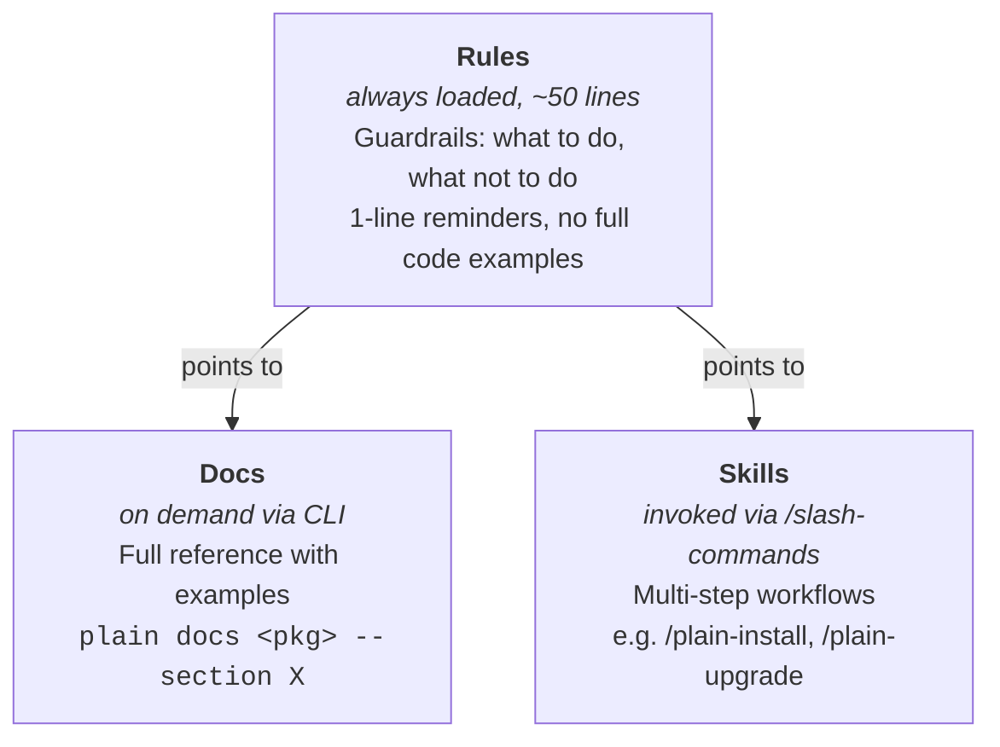

# Claude

## After making code changes

1. **Format and lint**: `./scripts/fix` (always run this before committing)
2. **Run tests**: `./scripts/test [package]`
3. **Server tests**: Add `--server` when changes touch `plain/server/` or `tools/` server scripts

## Commands

Always use `./scripts/` commands from the repo root — never run `uv run plain fix`, `uv run plain pre-commit`, etc. directly in the `example/` directory.

| Command                       | Purpose                                                      |
| ----------------------------- | ------------------------------------------------------------ |
| `./scripts/fix`               | Format and lint code                                         |
| `./scripts/pre-commit`        | Full pre-commit validation                                   |
| `./scripts/test [package]`    | Run tests (add `--server` when changing `plain/server/`)     |
| `./scripts/server-test`       | Server conformance, load, and resilience tests               |
| `./scripts/create-migrations` | Create database migrations (calls `plain migrations create`) |
| `./scripts/type-check <dir>`  | Type check a directory                                       |
| `uv run python`               | Open Python shell                                            |

## Scratch directory

Use the `scratch` directory for temporary files and experimentation. This directory is gitignored.

## Testing changes

The `example` directory contains a demo app. Use `cd example && uv run plain` to test.

## Backwards compatibility

Don't worry about backwards compatibility for API changes like function renames, argument changes, or import path updates. The `/plain-upgrade` skill integrates an AI agent into the upgrade process that can automatically fix user code during updates.

Deeper breaking changes that users can't directly control or fix in their own code still need careful consideration.

## Coding style

- Plain requires Python 3.13+ — use modern Python APIs and syntax freely (e.g. `X | Y` unions, `match`, `ExceptionGroup`, etc.)
- Prefer unique, greppable names over overloaded terms
- Verify changes with `print()` statements, then remove before committing

## CSP-safe by default (this repo's templates and assets)

This is an internal stance for code we ship in Plain itself — packages, the admin, the toolbar, the example app. User projects pick their own CSP and are free to relax it; our shipped templates and assets must work under a strict policy.

- **No inline `style="..."` attributes in our HTML templates.** Use Tailwind utility classes; for one-offs use Tailwind arbitrary values (`h-[400px]`, `bg-[#abcdef]`).
- **No `el.style.x = ...` mutations in our JS.** Toggle classes (`classList.add/remove`) instead. Tailwind v4's `!` suffix (`hidden!`) provides `!important` when needed to defeat library-internal inline styles.
- **Inline `<style>` and `<script>` tags must carry `nonce="{{ request.csp_nonce }}"`.**
- **No inline event handlers** (`onclick=`, `onload=`, etc.). Wire behavior in the relevant JS file.
- For dialogs, use the native HTML Invoker Commands API: `<button command="show-modal" commandfor="my-dialog">` — never `onclick="dialog.showModal()"`.
- For dynamic SVG colors, use the `fill=`/`stroke=` presentation attributes — those aren't covered by `style-src`.

The `example/` app runs the strict CSP — exercise admin/toolbar/template changes there before shipping. Library-internal violations from third-party deps (e.g. Chart.js setting canvas inline styles) are a known cost; don't add to them on our side.

## Docs, rules, and skills

Plain ships three tiers of AI guidance per package, each with a different purpose:


```mermaid
graph TD
    R["<b>Rules</b><br/><i>always loaded, ~50 lines</i><br/>Guardrails: what to do, what not to do<br/>1-line reminders, no full code examples"]
    D["<b>Docs</b><br/><i>on demand via CLI</i><br/>Full reference with examples<br/><code>plain docs &lt;pkg&gt; --section X</code>"]
    S["<b>Skills</b><br/><i>invoked via /slash-commands</i><br/>Multi-step workflows<br/>e.g. /plain-install, /plain-upgrade"]

    R -- "points to" --> D
    R -- "points to" --> S
```

### Rules

Concise guardrails always loaded into context. Keep them short (~50 lines) — bullet-point reminders, not tutorials. Point to docs for details. Use `paths:` frontmatter to scope rules to relevant files.

Django-specific corrections (e.g., "use X not Django's Y") belong only in `plain.md`'s "Key Differences from Django" section. Package rules should describe how Plain works, not what Django does differently. It's fine for those corrections to cross package boundaries — they live in one place.

Example pattern (from plain-postgres rule → querying section):

```
- Use `select_related()` for FK access in loops, `prefetch_related()` for reverse/M2N
- Use `.exists()` not `.count() > 0`, `.count()` not `len(qs)`

Run `uv run plain docs postgres --section querying` for full patterns with code examples.
```

### Docs

Package README.md files are the primary documentation — rendered on the website, PyPI, and GitHub. They're also available to AI via the CLI:

- `uv run plain docs postgres` — full docs
- `uv run plain docs postgres --section querying` — just the Querying section
- `uv run plain docs postgres --api` — public API surface from `__all__`

Write docs for humans first. Sections are `## ` headings in the README — keep each one self-contained enough to be useful when loaded independently via `--section`.

### Skills

Multi-step workflows invoked via `/slash-commands`. These coordinate tools, run commands, and guide multi-turn processes (e.g. installing a package, running a release).

### File locations

- **Package-level `<package>/plain/<module>/agents/.claude/`**: Source of truth. Shipped to end users via `plain agent install`.
- **Top-level `.claude/rules/` and `.claude/skills/`**: Copies for developing _this repo_. Generated by `plain agent install` — do not edit directly.
- A few top-level skills and rules (`release`, `readme`) are unique to development and have no package-level counterpart.

When editing a rule or skill, always edit the package-level file in `agents/.claude/` first. Then run `plain agent install` to sync.
