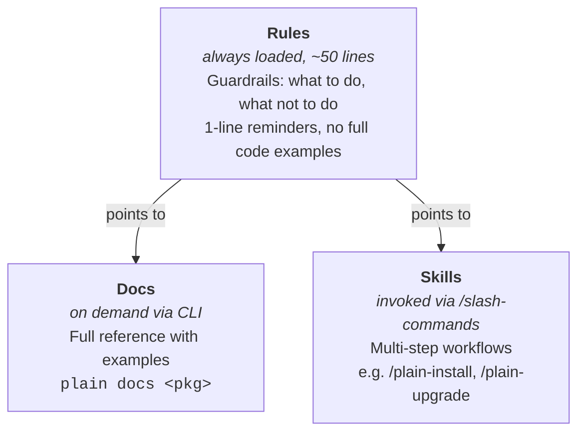

# Claude

## After making code changes

1. **Format and lint**: `./scripts/fix` (always run this before committing)
2. **Run tests**: `./scripts/test [package]`
3. **Server tests**: Add `--server` when changes touch `plain/server/` or `tools/` server scripts

## Commands

Always use `./scripts/` commands from the repo root — never run `uv run plain fix`, `uv run plain pre-commit`, etc. directly in the `example/` directory.

| Command                       | Purpose                                                      |
| ----------------------------- | ------------------------------------------------------------ |
| `./scripts/fix`               | Format and lint code                                         |
| `./scripts/pre-commit`        | Full pre-commit validation                                   |
| `./scripts/test [package]`    | Run tests (add `--server` when changing `plain/server/`)     |
| `./scripts/server-test`       | Server conformance, load, and resilience tests               |
| `./scripts/create-migrations` | Create database migrations (calls `plain migrations create`) |
| `./scripts/type-check <dir>`  | Type check a directory                                       |
| `uv run python`               | Open Python shell                                            |

## Scratch directory

Use the `scratch` directory for temporary files and experimentation. This directory is gitignored.

## Testing changes

The `example` directory contains a demo app. Use `cd example && uv run plain` to test.

## Public vs internal tests

Tests split by what they prove, not who typed them:

- **`<package>/tests/public/`** — the **contract**. Failures mean a user-visible behavior is broken.
- **`<package>/tests/internal/`** — the **change detector**. Failures mean something shifted; you decide whether it should have.

**Where does my test go?** Public tests assert at the layer the user interacts with.

- _Features_ (jobs, auth, requests, sessions): the user-interaction layer is end-to-end. `Client()`, run the worker, observe the user-visible outcome. Tests of the underlying queryset, middleware, or model in isolation sit _below_ that layer → internal.
- _Utility functions_ (`reverse_absolute`, `parse_dotenv`, `generate_code`): the function call _is_ the user-interaction layer. A return-value test is the contract → public.

Still unsure? **Would a failure surprise a user reading the changelog?** If yes → public.

**Internal-test tells:**

- Imports from `_internal`, or asserts on a symbol not in `__all__` / `plain docs <pkg> --api`
- Pokes module-level state or private attributes
- Pins instrumentation surface — OTel spans/metrics, log shape, internal counters
- Stages drift/edge scenarios with heavy helper machinery
- Wouldn't survive a feature rewrite

**Conventions:**

- **Lifecycle**: `internal/` tests are regenerable — delete and rewrite freely when features change. `public/` tests evolve deliberately.
- **Promotion**: when a test crosses into contract territory, move from `internal/` to `public/`; the reverse isn't a thing.

Both directories run in the normal pytest suite and must pass. Shared fixtures in `tests/conftest.py` are inherited by both.

## Backwards compatibility

Don't worry about backwards compatibility for API changes like function renames, argument changes, or import path updates. The `/plain-upgrade` skill integrates an AI agent into the upgrade process that can automatically fix user code during updates.

Deeper breaking changes that users can't directly control or fix in their own code still need careful consideration.

## Coding style

- Plain requires Python 3.13+ — use modern Python APIs and syntax freely (e.g. `X | Y` unions, `match`, `ExceptionGroup`, etc.)
- Prefer unique, greppable names over overloaded terms
- Verify changes with `print()` statements, then remove before committing

## CSP-safe by default (this repo's templates and assets)

This is an internal stance for code we ship in Plain itself — packages, the admin, the toolbar, the example app. User projects pick their own CSP and are free to relax it; our shipped templates and assets must work under a strict policy.

- **No inline `style="..."` attributes in our HTML templates.** Use Tailwind utility classes; for one-offs use Tailwind arbitrary values (`h-[400px]`, `bg-[#abcdef]`).
- **Prefer classes/`data-*` over `el.style` in our JS.** For discrete state, toggle classes or data attributes (`classList.add/remove`, `el.dataset.x = ...`) — declarative and diff-friendly. CSP does _not_ block CSSOM property setters (`el.style.transform = ...`, `el.style.setProperty(...)`), so they're acceptable for genuinely dynamic, continuous values a class can't express (a drag position, a drag-resize dimension). CSP _does_ block `style="..."` attributes, `el.style.cssText = ...`, and `el.setAttribute("style", ...)` — never use those. Tailwind v4's `!` suffix (`hidden!`) provides `!important` when needed to defeat library-internal inline styles.
- **Inline `<style>` and `<script>` tags must carry `nonce="{{ request.csp_nonce }}"`.**
- **No inline event handlers** (`onclick=`, `onload=`, etc.). Wire behavior in the relevant JS file.
- For dialogs, use the native HTML Invoker Commands API: `<button command="show-modal" commandfor="my-dialog">` — never `onclick="dialog.showModal()"`.
- For dynamic SVG colors, use the `fill=`/`stroke=` presentation attributes — those aren't covered by `style-src`.

The `example/` app runs the strict CSP — exercise admin/toolbar/template changes there before shipping. Library-internal violations from third-party deps (e.g. Chart.js setting canvas inline styles) are a known cost; don't add to them on our side.

## Docs, rules, and skills

Plain ships three tiers of AI guidance per package, each with a different purpose:


```mermaid
graph TD
    R["<b>Rules</b><br/><i>always loaded, ~50 lines</i><br/>Guardrails: what to do, what not to do<br/>1-line reminders, no full code examples"]
    D["<b>Docs</b><br/><i>on demand via CLI</i><br/>Full reference with examples<br/><code>plain docs &lt;pkg&gt;</code>"]
    S["<b>Skills</b><br/><i>invoked via /slash-commands</i><br/>Multi-step workflows<br/>e.g. /plain-install, /plain-upgrade"]

    R -- "points to" --> D
    R -- "points to" --> S
```

### Rules

Concise guardrails always loaded into context. Keep them short (~50 lines) — bullet-point reminders, not tutorials. Point to docs for details. Use `paths:` frontmatter to scope rules to relevant files.

Django-specific corrections (e.g., "use X not Django's Y") are split by scope so each loads only where it's relevant: **core** framework diffs (URLs, request data, middleware) live in `plain.md`'s "Key Differences from Django" section; **package-specific** diffs live in that package's rule under its own `## Differences from Django` section (see `plain-postgres`, `plain-templates`). Keep each correction in exactly one place — don't duplicate a package diff into `plain.md`. The rest of a rule should describe how Plain works, not what Django does differently.

Example pattern (from plain-postgres rule → querying section):

```
- Use `select_related()` for FK access in loops, `prefetch_related()` for reverse/M2N
- Use `.exists()` not `.count() > 0`, `.count()` not `len(qs)`

Run `uv run plain docs postgres` for full patterns with code examples.
```

### Docs

Package README.md files are the primary documentation — rendered on the website, PyPI, and GitHub. They're also available to AI via the CLI:

- `uv run plain docs postgres` — full docs
- `uv run plain docs postgres --search querying` — just the sections matching a term
- `uv run plain docs postgres --api` — public API surface from `__all__`

Write docs for humans first. Sections are `## ` headings in the README — keep each one self-contained so `--search` previews and per-module search results are useful on their own.

### Skills

Multi-step workflows invoked via `/slash-commands`. These coordinate tools, run commands, and guide multi-turn processes (e.g. installing a package, running a release).

### File locations

- **Package-level `<package>/plain/<module>/agents/.claude/`**: Source of truth. Shipped to end users via `plain agent install`.
- **Top-level `.claude/rules/` and `.claude/skills/`**: Copies for developing _this repo_. Generated by `plain agent install` — do not edit directly.
- A few top-level skills and rules (`release`, `readme`) are unique to development and have no package-level counterpart.

When editing a rule or skill, always edit the package-level file in `agents/.claude/` first. Then run `plain agent install` to sync.
