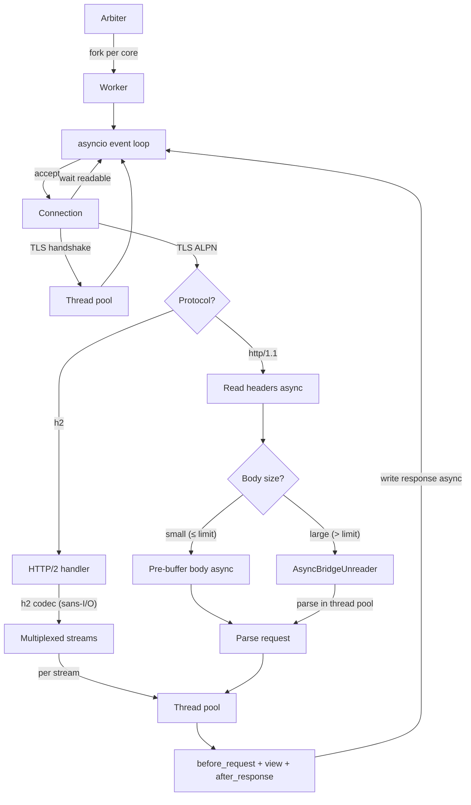

# Server

**A production-ready HTTP server with HTTP/2 support, originally based on gunicorn.**

- [Overview](#overview)
- [Workers and threads](#workers-and-threads)
- [Configuration options](#configuration-options)
- [Settings](#settings)
- [Signals](#signals)
- [FAQs](#faqs)
- [Architecture](#architecture)
- [Installation](#installation)

## Overview

You can run the built-in HTTP server with the `plain server` command.

```bash
plain server
```

By default, the server binds to `127.0.0.1:8000` with one worker process per CPU core and 4 threads per worker.

For local development, you can enable auto-reload to restart workers when code changes.

```bash
plain server --reload
```

## Workers and threads

The server uses two levels of concurrency:

- **Workers** are separate OS processes. Each worker runs independently with its own memory. The default is `0` (auto), which spawns one worker per CPU core.
- **Threads** run inside each worker. Threads handle application code (middleware and views) using a thread pool. All network I/O (accepting connections, reading requests, writing responses, TLS, keepalive) is handled asynchronously on the event loop without consuming threads. The default is 4 threads per worker.

Total concurrent requests = `workers × threads`. On a 4-core machine with the defaults, that's `4 × 4 = 16` concurrent requests.

**When to adjust workers:** Workers provide true parallelism since each is a separate process with its own Python GIL. More workers means more memory usage but better CPU utilization. Use `--workers 0` (the default) to match your CPU cores, or set an explicit number.

**When to adjust threads:** Threads are used exclusively for running your application code (middleware and views). This means `SERVER_THREADS` directly controls how many views can execute in parallel — it's not shared with I/O operations. Increase threads if your views spend a lot of time waiting on I/O (database queries, external API calls). Decrease to 1 if you need to avoid thread-safety concerns.

**Long-lived connections:** Async views (SSE, WebSocket) run on the worker's event loop instead of occupying a thread pool slot. This means long-lived connections don't reduce your capacity for regular requests.

```bash
# Explicit worker count
plain server --workers 2

# More threads for I/O-heavy apps
plain server --threads 8

# Single-threaded workers (simplest, one request at a time per worker)
plain server --threads 1
```

## Configuration options

All options are available via the command line. Run `plain server --help` to see the full list.

Most options can also be configured via settings (see below). CLI arguments take priority over settings.

| Option                           | Setting             | Description                          |
| -------------------------------- | ------------------- | ------------------------------------ |
| `--bind` / `-b`                  | -                   | Address to bind (can repeat)         |
| `--workers` / `-w`               | `SERVER_WORKERS`    | Worker processes (0=auto, CPU count) |
| `--threads`                      | `SERVER_THREADS`    | Threads per worker                   |
| `--timeout` / `-t`               | `SERVER_TIMEOUT`    | Worker timeout in seconds            |
| `--access-log / --no-access-log` | `SERVER_ACCESS_LOG` | Enable/disable access logging        |
| `--reload`                       | -                   | Restart workers on code changes      |
| `--certfile`                     | -                   | Path to SSL certificate file         |
| `--keyfile`                      | -                   | Path to SSL key file                 |

## Settings

Server behavior can be configured in your `settings.py` file. These are the defaults:

```python
SERVER_WORKERS = 0           # 0 = auto (one per CPU core)
SERVER_THREADS = 4
SERVER_TIMEOUT = 30
SERVER_ACCESS_LOG = True
SERVER_ACCESS_LOG_FIELDS = ["method", "path", "query", "status", "duration_ms", "size", "ip", "user_agent", "referer"]
SERVER_GRACEFUL_TIMEOUT = 30
SERVER_SENDFILE = True
SERVER_CONNECTIONS = 1000
SERVER_MAX_REQUESTS = 0      # 0 = disabled, restart worker after N requests
SERVER_MAX_REQUESTS_JITTER = 0  # random +/- variance to stagger restarts
```

Settings can also be set via environment variables with the `PLAIN_` prefix (e.g., `PLAIN_SERVER_WORKERS=4`).

The `WEB_CONCURRENCY` environment variable is supported as an alias for `SERVER_WORKERS`.

### Access log format

Access logs use the same `LOG_FORMAT` setting as the app logger, so they produce structured output in key-value or JSON format:

```
[INFO] Request method=GET path="/" status=200 duration_ms=12 size=1234 ip="127.0.0.1" user_agent="Mozilla/5.0..." referer="https://example.com"
```

See the [logs docs](../logs/README.md) for details on output formats.

### Access log fields

`SERVER_ACCESS_LOG_FIELDS` controls exactly which fields appear in access log entries. The default includes all common fields:

```python
# settings.py (default)
SERVER_ACCESS_LOG_FIELDS = [
    "method", "path", "query", "status", "duration_ms", "size",
    "ip", "user_agent", "referer",
]
```

Available fields: `method`, `path`, `url`, `query`, `status`, `duration_ms`, `size`, `ip`, `user_agent`, `referer`, `protocol`.

Use `url` for a combined path + query string (e.g., `url="/search?q=hello"`). Use `path` and `query` separately for production log aggregation.

In development, `plain dev` sets a minimal field list for cleaner output (`method`, `url`, `status`, `duration_ms`, `size`). Set `PLAIN_SERVER_ACCESS_LOG_FIELDS` in your environment to override.

### Per-response access log control

Individual responses can opt out of the access log by setting `log_access = False` on the response object. This is useful for noisy endpoints like health checks or asset serving.

```python
response = Response("ok")
response.log_access = False
return response
```

Plain uses this internally to suppress asset 304 responses (controlled by the `ASSETS_LOG_304` setting).

### How access logging works

Access logging has three layers, each at the right level of abstraction:

1. **`SERVER_ACCESS_LOG`** (server setting) — master switch that enables or disables access logging entirely.
2. **`response.log_access`** (per-response) — individual responses can opt out by setting `log_access = False`.
3. **`ASSETS_LOG_304`** (assets setting) — controls whether 304 Not Modified responses for assets are logged. When `False` (default), asset 304s set `log_access = False` on the response.

### Worker recycling

Long-running workers can accumulate memory from fragmentation, C extension leaks, or unbounded caches. `SERVER_MAX_REQUESTS` restarts workers after a set number of requests to keep memory usage in check.

```python
SERVER_MAX_REQUESTS = 1000        # Restart worker after 1000 requests
SERVER_MAX_REQUESTS_JITTER = 50   # Randomize by +/- 50 to stagger restarts
```

When a worker reaches the limit, it stops accepting new connections and drains in-flight requests before exiting. The arbiter automatically spawns a replacement.

Use `SERVER_MAX_REQUESTS_JITTER` in multi-worker deployments to prevent all workers from restarting at the same time. Both HTTP/1.1 requests and HTTP/2 streams count toward the limit.

## Signals

The server responds to UNIX signals for process management.

| Signal    | Effect            |
| --------- | ----------------- |
| `SIGTERM` | Graceful shutdown |
| `SIGINT`  | Quick shutdown    |
| `SIGQUIT` | Quick shutdown    |

## FAQs

#### How do I run with SSL/TLS?

Provide both `--certfile` and `--keyfile` options pointing to your certificate and key files.

```bash
plain server --certfile cert.pem --keyfile key.pem
```

When TLS is enabled, the server automatically negotiates HTTP/2 with clients that support it via ALPN, while remaining compatible with HTTP/1.1 clients.

#### How do I run behind a reverse proxy?

Configure your proxy to pass the appropriate headers, then use these settings to tell Plain how to interpret them:

```python
# settings.py

# Tell Plain which header indicates HTTPS (format: "Header-Name: value")
HTTPS_PROXY_HEADER = "X-Forwarded-Proto: https"

# Trust X-Forwarded-Host, X-Forwarded-Port, X-Forwarded-For headers
HTTP_X_FORWARDED_HOST = True
HTTP_X_FORWARDED_PORT = True
HTTP_X_FORWARDED_FOR = True
```

See the [HTTP settings docs](../../http/README.md) for details on proxy header configuration.

#### How do I handle worker timeouts?

If workers are being killed due to timeouts, increase the timeout. This is common when handling long-running requests.

```python
# settings.py
SERVER_TIMEOUT = 120
```

Or via the CLI:

```bash
plain server --timeout 120
```

## Architecture

Plain's server is vertically integrated — there is no WSGI/ASGI boundary between the server and the framework. The server, handler, and middleware are all part of the same system.

### Request lifecycle

A request passes through three layers:

1. **Server** — accepts the connection, handles TLS, parses HTTP, manages keep-alive. All network I/O runs on an asyncio event loop. The server's job is protocol correctness and resource protection (connection limits, timeouts, body size limits).

2. **Handler** — dispatched in the thread pool, the handler orchestrates the application response. It runs the middleware chain, resolves the URL, and dispatches the view. The handler is a thin coordinator — it doesn't make policy decisions.

3. **Middleware** — application-level logic that wraps request processing. Security policies (CSRF, host validation), session management, database connection lifecycle, and response headers all live here. Middleware uses two phases: `before_request` (can short-circuit with a response) and `after_response` (can modify the response). See the [HTTP middleware docs](../http/README.md#middleware) for details on writing custom middleware.

```
Client
  │
  ▼
Server (event loop)
  ├── Accept connection
  ├── TLS handshake
  ├── Parse HTTP headers + body
  ├── Health check (responds directly, no thread pool)
  │
  ▼
Handler (thread pool)
  ├── before_request middleware chain
  │     ├── Host validation
  │     ├── HTTPS redirect
  │     ├── CSRF check
  │     ├── Session load
  │     └── [user middleware]
  ├── URL resolution → View dispatch
  └── after_response middleware chain (reverse)
        ├── [user middleware]
        ├── Session save
        ├── Slash redirect
        └── Default headers
  │
  ▼
Server (event loop)
  └── Write response
```

### Connection handling

Each worker process runs an asyncio event loop that handles all network I/O. A thread pool is reserved exclusively for application code.



**Request body handling:** Small request bodies (≤ `DATA_UPLOAD_MAX_MEMORY_SIZE`, default 2.5MB) are pre-buffered on the event loop before parsing. Large bodies use `AsyncBridgeUnreader` which streams data lazily from the socket — the parser runs in the thread pool and bridges back to the event loop for socket reads. This keeps memory bounded while supporting large file uploads through multipart streaming to temp files.

**Async views note:** Async views that read the request body work with pre-buffered (small) requests. For large bodies on the bridge path, body reads must happen in the thread pool (sync views). If you need async views to handle large uploads, increase `DATA_UPLOAD_MAX_MEMORY_SIZE` to cover your expected body sizes.

## Installation

The server module is included with Plain. No additional installation is required.
